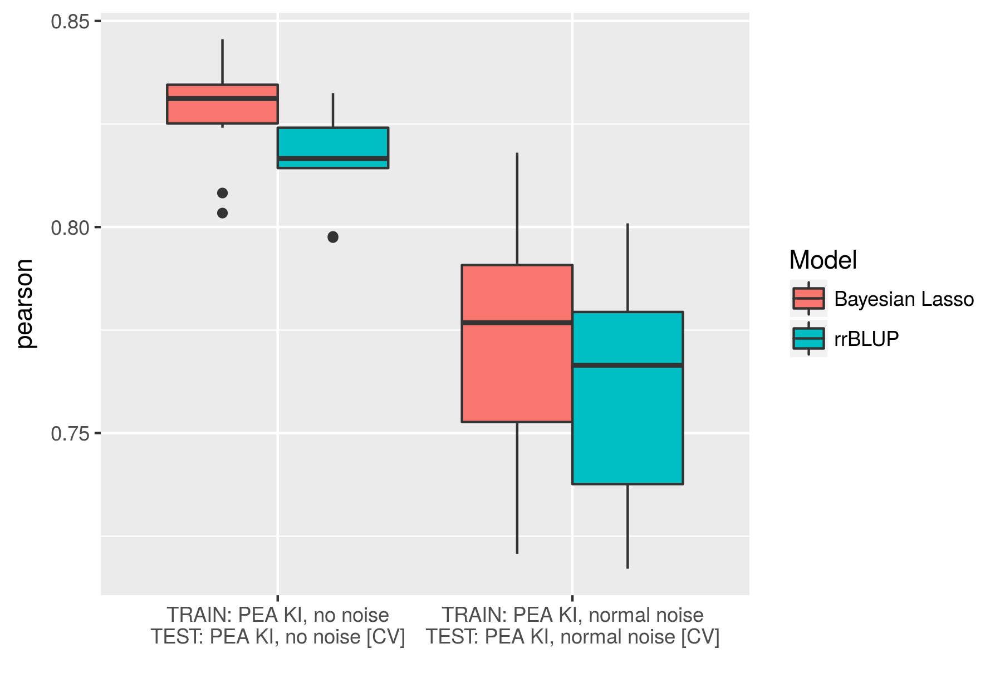
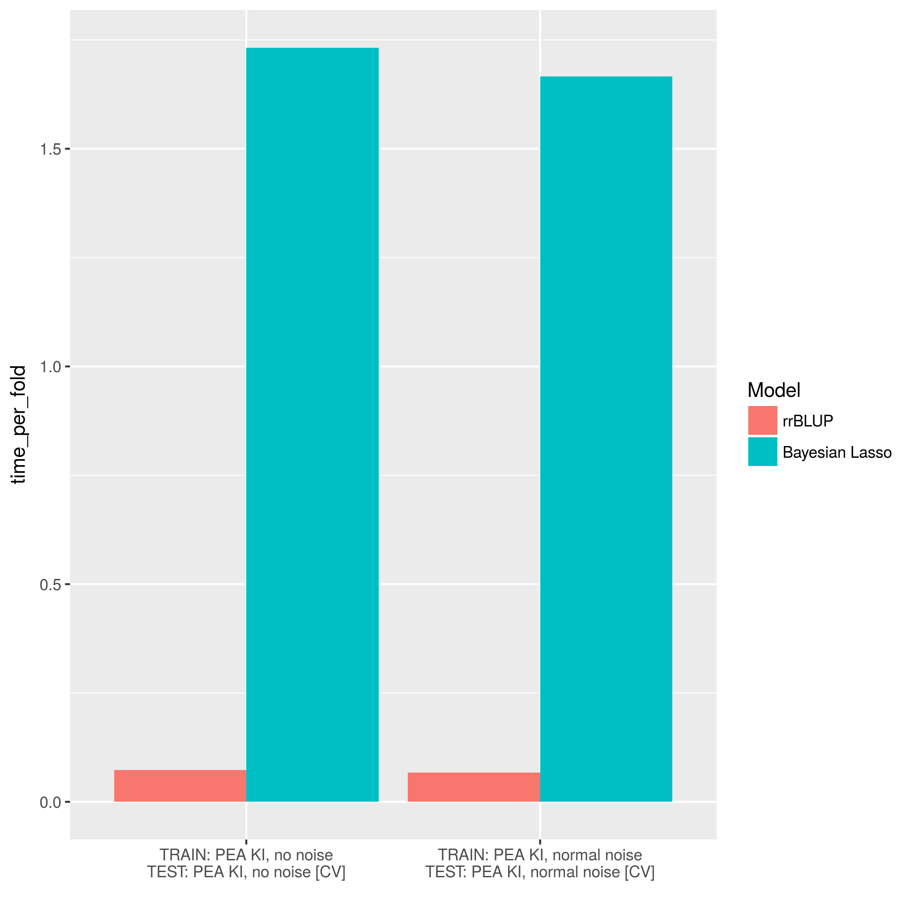

<!-- 
PLEASE NOTE

This is a vignette and it's not rebuilt automatically with the package.
To do so please use the following command:

devtools::build_vignettes()

And *then* rebuild the package, so it updates the doc.
--> 

```{r, eval=TRUE, include=TRUE, echo=FALSE}
#just to be sure
library(GROAN)
```

## Overview

GROAN package allows to assess the performances of one or more genomic regressors
when artificial noise is injected in an existing dataset. It is possible, however, 
to use GROAN to simply compare the prediction accuracy of different regression 
models without the injection of extra noise. Tests can either be perfomed on a single dataset (through crossvalidation) or multiple datasets (one for training, and one or more for testing). Crossvalidation and data management are transparent and the user is only required high level input.

The general workflow is the following:

1. create a __GROAN.NoisyDataSet object__ containing your training data (phenotypes, genotypes, and optionally other covariates). If appropriate, add a noise injector to add noise to the training set in a statistically controlled fashion
2. create a __GROAN.Workbench object__ describing the test to be operated (crossvalidation folds, number of repetitions and so forth) and your choice of genomic regressor
3. (optional) add more regressors to the workbench
4. (optional) create one or more extra __GROAN.NoisyDataSet objects__ for testing the trained models
5. run GROAN
6. examine results

GROAN package does not directly contain regressors, but leverages those implemented in the following packages (if installed):

* [BGLR](https://cran.r-project.org/package=BGLR): Bayesian Generalized Linear Regression (BayesA, BayesB, BayesC, Bayesian Lasso, RKHS, ...)
* [rrBLUP](https://cran.r-project.org/package=rrBLUP): Ridge Regression and Other Kernels for Genomic Selection
* [e1071](https://cran.r-project.org/package=e1071): Support Vector Regressors
* [randomForest](https://cran.r-project.org/package=randomForest): Random Forest Regressor

If you want to test your own regressor (or one taken from another package) you need to write a wrapper function, as detailed [here](#custom_regressor).

If you want to customize the type of injected noise you need to write a noise injector function,
as detailed [here](#custom_noise_injector).

## Example data
In the rest of this document we refer to GROAN.KI and GROAN.AI, two dataset indluded in the package. 
GROAN.KI and GROAN.AI contain data of 103 and 105 pea lines, respectively. The pea samples were
genotyped for 647 SNPs coming from genotyping-by-sequencing (GBS). The datasets contain also a single phenotypic trait (grain yield, measured in t/ha). The datasets come in the form of two list, each one containing the following fields:

```{r, eval=FALSE, include=TRUE, echo=TRUE, results='hide'}
library(GROAN)

#arrays of phenotypes
GROAN.KI$yield
GROAN.AI$yield

#dataframes of SNP genotypes
GROAN.KI$SNPs
GROAN.AI$SNPs

#dataframes of realized genotypic kinship
GROAN.KI$kinship
GROAN.AI$kinship
```

For more details on the data format please refer to the package help.
For more details on the datasets in general please refer to:

Annicchiarico et al., _GBS-Based Genomic Selection for Pea Grain Yield under Severe Terminal Drought_, The Plant Genome, Volume 10. \doi{doi:10.3835/plantgenome2016.07.0072}

## Create a GROAN.NoisyDataset
A GROAN.NoisyDataset is an object containing an instance of the original (noiseless) data and a reference to a noise injector function. It is created using the __createNoisyDataset__ function. If no noise injector function is specified, no noise will be added (the default noise injector, _noiseInjector.dummy_, does not add noise).

```{r, eval=TRUE, include=TRUE, echo=TRUE}
#creating a GROAN.NoisyDataset without any extra noise injected
nds.no_noise = createNoisyDataset(
  name = 'PEA KI, no noise',
  genotypes = GROAN.KI$SNPs, 
  phenotypes = GROAN.KI$yield
)

#creating a GROAN.NoisyDataset adding noise sampled from a normal distribution
nds.normal_noise = createNoisyDataset(
  name = 'PEA KI, normal noise',
  genotypes = GROAN.KI$SNPs, 
  phenotypes = GROAN.KI$yield,
  noiseInjector = noiseInjector.norm,
  mean = 0,
  sd = sd(GROAN.KI$yield) * 0.5
)

#creating a third dataset, this time with data from the AI lines
nds.no_noise.AI = createNoisyDataset(
  name = 'PEA AI, no noise',
  genotypes = GROAN.AI$SNPs, 
  phenotypes = GROAN.AI$yield
)

```

The noise is injected _on demand_ each time the function __getNoisyPhenotype__ is invoked:

```{r eval=TRUE, echo=TRUE, fig.align="center", fig.height=5, fig.width=5, include=TRUE}
#plotting the original phenotypes
plot(GROAN.KI$yield, pch=20, main = 'True (black) vs. Noisy (red)', xlab = 'Samples', ylab = 'Phenotypes')
#plotting an instance of the phenotypes with noise injected 
points(getNoisyPhenotype(nds.normal_noise), col='red')
```

Noise injectors usually leverage a stochastic mechanism to add noise. Therefore, successive calls to __getNoisyPhenotype__ produce (slighly) different results.

```{r eval=TRUE, include=TRUE, echo=TRUE, , results='hold'}
#average correlation oscillates around 0.89
cor(GROAN.KI$yield, getNoisyPhenotype(nds.normal_noise))
cor(GROAN.KI$yield, getNoisyPhenotype(nds.normal_noise))
cor(GROAN.KI$yield, getNoisyPhenotype(nds.normal_noise))
```

Obviously in absence of noise no variability is present.

```{r eval=TRUE, include=TRUE, echo=TRUE}
#no noise injector ==> the original phenotypes are returned
all(GROAN.KI$yield == getNoisyPhenotype(nds.no_noise))
```

It is possible to invoke both _print_ and _summary_ methods to quickly inspect the created objects

```{r eval=TRUE, include=TRUE, echo=TRUE}
print(nds.no_noise)
print(nds.no_noise.AI)
```

### Available Noise Injectors
The following noise injectors are implemented in GROAN:

Function name         | Effect
--------------------- | ----------------------------------
noiseInjector.dummy	  | No effect, used for comparing models without adding noise
noiseInjector.norm	  | Injects normal (gaussian) noise
noiseInjector.swapper	| Swaps phenotypes between samples
noiseInjector.unif    | Injects uniform noise

It is possible to extend GROAN functionalities by writing your own
noise injector, as detailed [here](#custom_noise_injector).

## Create a GROAN.Workbench
A GROAN.Workbench is an object describing both the regressor(s) that will be tested
and some configuration regarding the test itself. A GROAN.Workbench object is created using
the __createWorkbench__ function. The main parameters of interest are:

* the number of fold (as in k-fold crossvalidation). Defaults to 10. If NULL no crossvalidation happens and all training data will be used. In this case at least a second dataset, for test, is needed
* at least one regressor, optionally with its own parameters. The defaults regressor comes from
[rrBLUP](https://cran.r-project.org/package=rrBLUP) package
* the number of repetitions of the whole test. Repetitions are required to ensure numeric stability and to be able to estimate confidence intervals. Defaults to 5.
* a flag indicating if strata (i.e. sample subgrouping) should be take into account. This has two effects: on crossvalidation, where GROAN will maintain the same proportion of subgroups in training and test sets; and on accuracy estimation, where statistics will be provided considering the test set as a whole __and__ breaking it down by strata. Defaults to FALSE.
* where and what to save to hard-disk. The default is to save nothing, with the function simply returning the regression performances. GROAN can however save, for each repetition (and fold) of training, the found hyperparameters in a compact table form. Moreover, it is possible to save the actual trained R objects for detailed inspection. 

In its simplest form, a GROAN.Workbench can be created using all defaults. So this call:

```{r, eval=TRUE, include=TRUE, echo=TRUE}
#creating a Workbench with default values 
wb = createWorkbench()
```

is equivalent to the following one, where all default parameters are explicitly assigned:

```{r, eval=TRUE, include=TRUE, echo=TRUE}
#creating a GROAN.Workbench with default values explicitly assigned 
wb = createWorkbench(
  #parameters defining crossvalidation
  folds = 5, reps = 10, stratified = FALSE, 
  
  #parameters defining save-on-hard-disk policy
  outfolder = NULL, saveHyperParms = FALSE, saveExtraData = FALSE,
  
  #a regressor
  regressor = phenoRegressor.rrBLUP, regressor.name = 'rrBLUP'
)
```

Actually, the default _regressor.name_ is "default regressor", but it was changed in the example for clarity.

It is possible to update the GROAN.Workbench object by adding other regressors using the __addRegressor__ function:

```{r, eval=TRUE, include=TRUE, echo=TRUE}
#adding a regressor to an existing Workbench
wb = addRegressor(
  #the Workbench to be updater
  wb,
  #the new regressor
  regressor = phenoRegressor.BGLR, regressor.name = 'Bayesian Lasso',
  
  #regressor-specific parameters
  type = 'BL'
)
```

The previous operation can be repeated as many times as necessary. Just remember to actually
update the Workbench instance, and to assign sensible names to the regressors (they will be 
used, later, to investigate the results).

It is possible to invoke the _print_ method to quickly inspect the created objects:
```{r, eval=TRUE, include=TRUE, echo=TRUE}
print(wb)
```
### Available Regressors
The following regressors are implemented in GROAN:

Function name         | Effect
--------------------- | ----------------------------------
phenoRegressor.BGLR   | Regressors from [BGLR](https://cran.r-project.org/package=BGLR) package (Bayes A, B, C, Bayesian Lasso, G-BLUP, RKHS, ...)
phenoRegressor.dummy  | A dummy function returning random values, for test/development purposes.
phenoRegressor.RFR    | Random forest regression from package [randomForest](https://cran.r-project.org/package=randomForest) (caution: very slow)
phenoRegressor.rrBLUP | Regressor from [rrBLUP](https://cran.r-project.org/package=rrBLUP) package, implements SNP blup with ridge-regression-like solution
phenoRegressor.SVR    | Support Vector Regression from package [e1071](https://cran.r-project.org/package=e1071). It can operate in three modes: a) _no training_ (an existing SVR object is needed), b) _training_ (when hyperparameters are known) and c) _tuning_ (when hyperpareters need to be optimized in a grid search, very slow)

It is possible to extend GROAN functionalities by writing your own
regressor, as detailed [here]({#custom_regressor})

## Run GROAN, check results
To run GROAN you need at least GROAN.NoisyDataset object and a GROAN.Workbench object. Once you have them the actual test is executed using the __GROAN.run__ function.

The result is a GROAN.Result, an object that behaves like a data frame with one row per regressor __times__ the number of repetitions __times__ the number of test sets. In case of simple crossvalidation, each row represents a full crossvalidation of one regressor on the dataset. 
Columns contain measures of correlation between real and predicted phenotypes, measures of error, and execution time. The GROAN.Result can be saved automatically on hard disk by setting parameter `outfolder` in the Workbench. In case of crossvalidation the test dataset in the result object will report the "[CV]" suffix.

Details are reported in __GROAN.run__ documentation.

For reporting purposes it is possible to collate together (and filter) several result data frames, as shown here:

```{r, eval=FALSE, include=TRUE, echo=TRUE}
#executing two GROAN test, same workbench, different datasets
res.no_noise     = GROAN.run(nds.no_noise, wb)
res.normal_noise = GROAN.run(nds.normal_noise, wb)

#putting the results together for further analysis
res.total = rbind(res.no_noise, res.normal_noise)
```

The returned GROAN.Result has both a _print_ and a summary _method_, but for quick inspection it's possible to use the __plotResult__ function. The function leverages the [ggplot2](https://cran.r-project.org/package=ggplot2) package and returns a ggplot object. It is possible to select the performance meausure to be plotted, together with the type of plot.

```{r, eval=FALSE, include=TRUE, echo=TRUE}
#defaults is a boxplot of Pearson's correlations
p = plotResult(res.total)
print(p)
```

```{r, out.width = "600px", eval=TRUE, include=TRUE, echo=FALSE}

```

```{r, eval=FALSE, include=TRUE, echo=TRUE}
#a barplot with 95% confidence interval of Pearson's correlations
p = plotResult(res.total, plot.type = 'bar_conf95')
print(p)
```

```{r, out.width = "600px", eval=TRUE, include=TRUE, echo=FALSE}
knitr::include_graphics('plot2.png')
```

```{r, eval=FALSE, include=TRUE, echo=TRUE}
#a barplot of execution times per fold, in seconds
p = plotResult(res.total, plot.type = 'bar', variable = 'time')
print(p)
```

```{r, out.width = "600px", eval=TRUE, include=TRUE, echo=FALSE}

```

## Working with strata

When calling function __createWorkbench__ set argument `stratified` to TRUE to tell GROAN to take into account data strata. This will have two effects:

1. when crossvalidating, GROAN will split folds so that training and test sets will contain the same proportions of each data stratum 
2. prediction accuracy will be assessed (also) by strata

Data strata are defined within the GROAN.NoisyDataset through parameter `strata` in __createNoisyDataset__.

In the following code datasets GROAN.KI and GROAN.AI are put together, and strata are used to separate the two crosses.

```{r, eval=FALSE, include=TRUE, echo=TRUE}
#collating the two example datasets
nds.double = createNoisyDataset(
  name = 'KI and AI', 
  genotypes = rbind(GROAN.KI$SNPs, GROAN.AI$SNPs), 
  phenotypes = c(GROAN.KI$yield, GROAN.AI$yield),
  strata = c(rep('KI', 103), rep('AI', ,105)) #we have 103 KI and 105 AI
)

#the workbench will take into account strata
wb = createWorkbench(stratified = TRUE)

#ready to go
res = GROAN.run(nds.double, wb)
plotResult(res, strata = 'single', plot.type = 'bar')
```
```{r, out.width = "600px", eval=TRUE, include=TRUE, echo=FALSE}

```


## Beyond crossvalidation: testing on different datasets

It is possible to use GROAN to train models on one dataset and test them on one or more others. This is obtained through the parameter `nds.test` in GROAN.run invocation:

```{r, eval=FALSE, include=TRUE, echo=TRUE}
#a new GROAN.Workbench with NO crossvalidation and only one repetition
wb = createWorkbench(
  folds = NULL, reps = 1, 
  regressor.name = 'rrBLUP', regressor = phenoRegressor.rrBLUP)
  
#training on PEA.KI, testing on PEA.AI
res = GROAN.run(nds = nds.normal_noise, wb = wb, nds.test = nds.no_noise.AI)

print(res[,c('dataset.train', 'dataset.test', 'pearson')])
```

dataset.train        | dataset.test      | pearson
-------------------- | ----------------- | ----------
PEA KI, normal noise |	PEA AI, no noise | 0.1690525

It is also possible to mix up crossvalidation with testing with different datasets:

```{r, eval=FALSE, include=TRUE, echo=TRUE}
#a new GROAN.Workbench with 5-fold crossvalidation and only one repetition
wb = createWorkbench(
  folds = 5, reps = 1, 
  regressor.name = 'rrBLUP', regressor = phenoRegressor.rrBLUP)
  
#training on PEA.KI, testing on PEA.KI (crossvalidation) and PEA.AI
res = GROAN.run(nds = nds.normal_noise, wb = wb, nds.test = nds.no_noise.AI)

print(res[,c('dataset.train', 'dataset.test', 'pearson')])
```

dataset.train        | dataset.test               | pearson
-------------------- | -------------------------- | ----------
PEA KI, normal noise |	PEA AI, no noise          | 0.2045428
PEA KI, normal noise |	PEA KI, normal noise [CV] | 0.7613710

To test the model on more than one extra dataset simply put them in a list:
```{r, eval=FALSE, include=TRUE, echo=TRUE}
#training on PEA.KI, testing on PEA.KI (crossvalidation), PEA.AI, and PEA.KI again (overfitting!)
res = GROAN.run(
  nds = nds.normal_noise, wb = wb, 
  nds.test = list(nds.no_noise.AI, nds.no_noise)
  )

print(res[,c('dataset.train', 'dataset.test', 'pearson')])
```
dataset.train        | dataset.test               | pearson
-------------------- | -------------------------- | ----------
PEA KI, normal noise |	PEA AI, no noise          | 0.2633936
PEA KI, normal noise |	PEA KI, no noise          | 0.8923094
PEA KI, normal noise |	PEA KI, normal noise [CV] | 0.7955882

## Extended results: hyperparameters and extra information
The data frame returned by __GROAN.run__ contains the basic performance evaluation operated by GROAN. Several extra information can be stored on hard disk for later examination. This is done setting the appropriate policy on data saving when creating the __GROAN.Workbench__ object. The following options are available:

Mode                   | How                   | What
---------------------- | --------------------- | ----------------------------------
Don't save anything	   | outfolder=NULL        | Nothing will be saved on hard disk.
Save summary	         | outfolder='some/path' | A subfolder will be created in the passed path, named after the run.id, containing an "accuracy.csv" file.
...and hyperparameters | outfolder='some/path'<br>saveHyperParms=TRUE | Same as above, but save also hyperpameters from regressor tuning in csv format.
...and extra data      | outfolder='some/path'<br>saveExtraData=TRUE  | Same as above, but save also extra data from regressor tuning in R format.

Hyperparameters are (usually numeric) values tuned during training phase. Not all regressors require hyperparameter tuning, and the exact nature of hyperparameters depends on the regressor.

Extra data are saved using R __save__ function, and can be accessed using the __load__ function. One extra data bundle is save for each regressor _times_ crossvalidation folds _times_ experiment repetitions. Each bundle will usually contain at least the tuned model, but details depend on regressor function.

## Doing actual predictions

Once you have decided what regressor (and what hyper parameters configuration) is best for your data you may want to do actual phenotype predictions. To do so you can directly call one of the available _phenoRegressor_ functions. For the sake of argument, let's use half of the GROAN.KI dataset for training and let's predict the other half. Each _phenoRegressor_ will predict "the holes" in the passed phenotypes, meaning that it will fill all slots containing NA with a predicted phenotype.

```{r eval=TRUE, echo=TRUE, fig.align="center", fig.height=5, fig.width=5, include=TRUE}
  #GROAN.KI has 103 samples, we'll use the first 50 samples for training
  #and the remaining will be predicted
  my.pheno = GROAN.KI$yield
  my.pheno[51:103] = NA

  #doing the predictions
  res = phenoRegressor.rrBLUP(phenotypes = my.pheno, genotypes = GROAN.KI$SNPs)
  
  #we just obtained a list with the following fields
  print(names(res))
  
  #visualize the predictions
  plot(
    x = GROAN.KI$yield[51:103], xlab = 'Real values', 
    y = res$predictions[51:103], ylab = 'Predicted values'
  )
  abline(a=0, b=1) #adding first quadrant bisector, for reference
```

## Expand GROAN: custom noise injector {#custom_noise_injector}
If none of the available noise injectors satisfies your needs it is possible to write and use a custom injector in your experiments. This is done in two steps: 1) write the injector 2) include it in a GROAN.NoisyDataSet object.

Custom injectors need to accept at least one argument called `phenotypes`. When GROAN calls the injector this argument will be a numeric array containing the phenotypes that will be used to train the regressor(s). The function is required to return a numeric array of the same size as "phenotypes", 
with its values added of noise. For the sake of arguments let's suppose we want to investigate the effects of a bias noise acting on a half of the data, as illustrated by the following code:

```{r, eval=FALSE, include=TRUE, echo=TRUE}
#A noise injector adding a fixed bias to a random subset of about 50% of the data
my.noiseInjector.bias = function(phenotypes){
  #an array of random booleans
  labels = runif(length(phenotypes)) > 0.5
  
  #adding the bias (a fixed value of 5)
  phenotypes[labels] = phenotypes[labels] + 5
  
  #returning the original phenotypes with added noise
  return(phenotypes)
}
```

To use the injector we just defined we need to include it in the definition of a __GROAN.NoisyDataSet__:

```{r, eval=FALSE, include=TRUE, echo=TRUE}
#A GROAN.NoisyDataSet that embeds the bias noise
nds.bias_noise = createNoisyDataset(
  name = 'PEA, bias noise',
  genotypes = GROAN.KI$SNPs, 
  phenotypes = GROAN.KI$yield,
  noiseInjector = my.noiseInjector.bias   #the function we defined above
)
```

It is possible for the noise injector function to have extra arguments other than phenotypes. In the following version of the bias noise injector the amount of bias is an input from the user:

```{r, eval=FALSE, include=TRUE, echo=TRUE}
#An improved version of the above function, this time the bias is not fixed
my.noiseInjector.bias2 = function(phenotypes, bias = 5){
  #an array of random booleans
  labels = runif(length(phenotypes)) > 0.5
  
  #adding the bias (from the function argument)
  phenotypes[labels] = phenotypes[labels] + bias
  
  #returning the original phenotypes with added noise
  return(phenotypes)
}
```

The call to __createNoisyDataset__ can now assign values to the noise injector arguments:

```{r, eval=FALSE, include=TRUE, echo=TRUE}
#A NoisyDataSet with bias noise function, using the second version of the function
nds.bias_noise2 = createNoisyDataset(
  name = 'PEA, bias noise, second function',
  genotypes = GROAN.KI$SNPs, 
  phenotypes = GROAN.KI$yield,
  noiseInjector = my.noiseInjector.bias2,   #the new version
  bias = 20 #if omitted the default would be used
)
```

Please pay attention to avoid naming conflicts between the new regressor arguments and the ones from __createNoisyDataset__. Once the function is defined and embedded in a GROAN.NoisyDataset it is possible to select a regressor and test the effect of the newly defined noise.

## Expand GROAN: custom regressor {#custom_regressor}
If none of the available regressors satisfies your needs it is possible to write a custom regressor for your experiments. This is done in two steps: 1) write the regressor function 2) include it in a GROAN.WorkBench object.

Please understand that the regressor will be called in a crossvalidation procedures. It will thus have access to the complete genotypes (SNPs and/or covariances) and covariates, but the phenotype array willvcontain some missing values (NAs). This are the values to be predicted.

Each custom regressor function _needs_ to accept the following input arguments:

* `phenotypes` : a numeric array (N x 1), missing values are to be predicted.
* `genotypes` : genotypes, one row per phenotype (N), one column per marker (M), values in 0/1/2 (for diploids) or 0/1/2/.../ploidy in case of polyploids. Order is such that each row has a corresponding slot in the phenotypes array. Some rows will thus correspond to missing values.
* `covariances` : numeric matrix of covariances between samples. It is usually a square (NxN) matrix, but rectangular matrices (NxW) are accepted to incapsulate covariances between samples of one set and samples of other sets. Order is such that each row will have a corresponding slot in the phenotypes array. Some rows and columns will thus correspond to missing values.
* `extraCovariates` : extra covariates set, one row per phenotype (N), one column per covariate (K). If NULL no extra covariates are to be considered.      
* `...` : zero or more extra parameters can be added to further define the behaviour of the regression algorithm.

Checks on input (type, size) are not required, since these functions are supposed to
be used in a GROAN experiment, where checks are done when __NoisyDataset__ and __Workbench__ are created.
Please note that the variables will reflect what is stored in the __NoisyDataSet__ object. The function should return a list with the following fields:                        

* _$predictions_ : a numeric array (N x 1) of phenotypes, with all NAs filled (predicted) 
* _$hyperparams_ : (optional) named array of hyperparameters selected during training
* _$extradata_ : (optional) list of whatever extra data/objects are produced during training that could be of interest for later inspection.

The following snippet of code shows the implementation of __phenoRegressor.dummy__ function. The  "predictions" are actually random values, with genotypes, covariances and extra covariates being ignored. It is useful to show the required function signature.

```{r, eval=FALSE, include=TRUE, echo=TRUE}
phenoRegressor.dummy = function (phenotypes, genotypes, covariances, extraCovariates){
  #no operation is actually required
  return(list(
    predictions = runif(length(phenotypes)), #predictions
    hyperparams = c(some = 1, params='a'),
    extradata = 'filler extra data for phenoRegressor.dummy'
  ))
}
```

The function above can be used as `regressor` argument for both __createWorkbench__ and __addRegressor__ functions.
